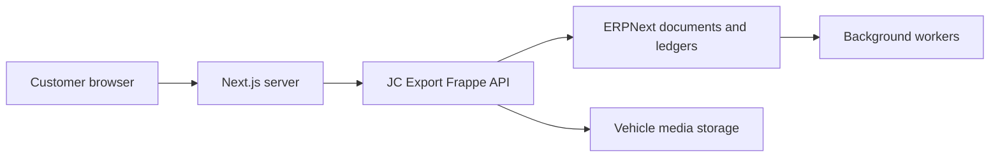
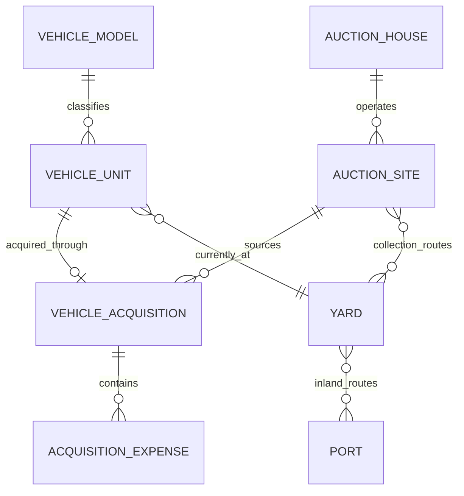

# Core Domain

## Objectives

- Represent every used vehicle once.
- Keep auction sourcing separate from vehicle inventory.
- Use references instead of free-text auction, yard, port, and supplier names.
- Separate operational, publication, sales, payment, and shipment states.
- Preserve the original commercial facts used by quotations and invoices.
- Support vehicles acquired from auctions, dealers, trade-ins, and company stock.

## System boundary

The public website and customer portal remain in Next.js. ERPNext/Frappe owns
the operational and financial truth.



The browser must never receive an ERP API secret or call unrestricted Frappe
resources directly.

## Core records

### Vehicle Model

A reusable description of a make/model combination. It is not an individual
vehicle.

| Field | Purpose |
| --- | --- |
| Make | Toyota, Honda, Nissan |
| Model | Corolla, Vezel, Note |
| Model code | Manufacturer model code |
| Body type | SUV, sedan, hatchback, truck |
| Default dimensions | Length, width, height, volume |
| Default weight | Used only when a measured value is unavailable |
| Fuel/transmission/drive | Reusable catalog attributes |

### Vehicle Unit

The authoritative record for one physical used vehicle.

| Group | Important fields |
| --- | --- |
| Identity | Stock number, chassis/VIN, registration number |
| Classification | Vehicle Model, body type, asset subtype |
| Specification | Year, engine, mileage, grade, colors, seats, doors |
| Measurements | Length, width, height, measured m3, weight |
| Condition | Auction grade, inspection summary, damage notes |
| Source | Acquisition source and linked acquisition record |
| Location | Current yard/port and location timestamp |
| Commercial | Base selling price policy, display-price controls |
| Media | Primary image and ordered media collection |
| Lifecycle | Separate state fields described below |

Chassis/VIN and stock number must be unique where present. Auction vehicles and
owned vehicles use the same Vehicle Unit record.

### Auction House and Auction Site

An auction company may operate multiple physical sites. Pricing and logistics
must reference the site, not a free-text auction name.

```text
Auction House
  USS
    Auction Site: USS Tokyo
    Auction Site: USS Nagoya
    Auction Site: USS Kobe
```

Important Auction Site fields:

- Auction House
- Site code and display name
- Address and geographical coordinates
- Default collection yard
- Available collection routes
- Supplier/accounting reference

### Yard

A physical vehicle location or consolidation facility.

- Name and code
- Operator/supplier
- Address and coordinates
- Supported shipment modes
- Nearby export ports
- Storage and handling policies

### Port

A single canonical port record:

- UN/LOCODE where available
- Name, city, and country
- Port type
- Supported shipment modes
- Time zone
- Active status

Origin and destination ports use the same entity. Country and region are
properties of the port; they are not copied into every rate record.

### Vehicle Acquisition

Captures how the company obtained a vehicle.

- Vehicle Unit
- Acquisition source type
- Auction House and Auction Site, when applicable
- Supplier/dealer
- Auction date and lot number
- Purchase currency and purchase amount
- Auction result and purchase status
- Buyer and approving staff
- Linked Purchase Order/Receipt/Invoice

Acquisition expenses are line items, not columns:

```text
Auction commission
Government tax
Recycle fee
Number plate fee
Collection
Inland transport
Inspection
Repair
Detailing
Other
```

Each line contains charge type, supplier, amount, currency, tax treatment, and
source document. ERPNext Landed Cost Voucher or an equivalent posting process
capitalizes eligible costs into the vehicle.

## Relationships



## Independent lifecycle states

One `status` field must not represent several business processes.

### Operational state

```text
Draft -> Purchased -> In Transit to Yard -> In Yard -> Inspecting
-> Preparing -> Ready for Export -> Sold -> Archived
```

### Publication state

```text
Hidden -> Draft Listing -> Published -> Reserved -> Sold
```

### Sales state

Owned by Opportunity, Quotation, and Sales Order:

```text
Inquiry -> Quoted -> Negotiating -> Reserved -> Confirmed
```

### Payment state

Derived from submitted Sales Invoices and Payment Entries:

```text
Unpaid -> Partially Paid -> Paid
```

Payment state must not be manually stored on Vehicle Unit.

### Shipment state

Owned by Export Shipment:

```text
Planning -> Booked -> At Port -> Loaded -> In Transit
-> Arrived -> Released -> Delivered
```

Uploading a document does not automatically prove that a vehicle has physically
reached a shipment milestone.

## Accounting rules

- Use decimal/currency fields, never binary floating-point money.
- Store one amount with one currency.
- Use ERPNext ledgers as the source of customer balances.
- Do not maintain `customer_balance_usd`, `customer_balance_jpy`, or equivalent
  columns.
- Submitted financial documents are corrected through cancellation, amendment,
  debit note, or credit note workflows.
- Transaction documents retain their commercial snapshot even when master data
  later changes.

## Initial Frappe mapping

| Business concept | Frappe/ERPNext implementation |
| --- | --- |
| Vehicle Model | Item or custom Vehicle Model linked to Item |
| Vehicle Unit | Custom DocType linked to Item and Serial No |
| Auction company | Supplier plus custom Auction House |
| Auction site | Custom Auction Site |
| Yard | Warehouse plus custom operational fields |
| Port | Custom Port |
| Acquisition | Purchase documents plus custom Vehicle Acquisition |
| Acquisition expense | Child rows and Landed Cost Voucher |
| Vehicle media | File records plus ordered Vehicle Media children |

The exact Item/Serial No integration will be validated in a Frappe prototype
before finalizing the schema.

## Validation required

Before implementation, confirm:

- Whether stock number is assigned before or after purchase.
- Whether one chassis can ever be re-imported as another stock record.
- Whether vehicles can move between multiple yards before export.
- Whether auction, dealer, and company-owned vehicles follow different approval
  flows.
- Which acquisition costs must be capitalized and which remain period expenses.
