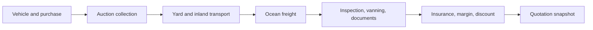

# Pricing Engine

## Problem being solved

The previous system stores large combinations of:

```text
Auction house x yard x origin port x destination x shipment mode
x vehicle class x currency
```

This creates a Cartesian explosion. A change to one freight rate requires many
rows, while missing combinations silently return zero or use hardcoded browser
values.

The new engine stores independent rates and composes them for a specific
vehicle and destination.

## Pricing pipeline



Auction House affects auction fees and collection. It must not become a
dimension of an ocean-freight rate when vehicles from several auctions leave
from the same origin port.

## Rate records

### Export Rate Card

Groups rates supplied or approved together.

| Field | Purpose |
| --- | --- |
| Name/version | Human-readable rate-book identity |
| Provider | Carrier, transporter, inspector, or JC Export |
| Valid from/until | Effective period |
| Status | Draft, Approved, Expired, Disabled |
| Source document | Supplier tariff or uploaded agreement |
| Approved by/at | Audit and authorization |

An approved card is immutable. Corrections create a new version.

### Export Rate Rule

One row represents one monetary rule.

| Field | Examples |
| --- | --- |
| Component | Collection, inland, ocean freight, vanning, inspection |
| Origin type/reference | Auction Site, Yard, Port, or none |
| Destination type/reference | Yard, Port, Country, Region, or none |
| Shipment mode | RoRo, container, flat-rack |
| Container type | 20ft, 40ft, 40ft HC |
| Vehicle selector | Exact unit, class, body type, or all |
| Calculation basis | Flat, per m3, per kg, per vehicle, per container, percent |
| Amount/rate | Decimal value |
| Currency | Exactly one currency |
| Minimum/maximum | Optional limits |
| Priority | Explicit exception priority |
| Conditions | Structured fields, not executable code |

Common conditions must be first-class fields. A generic JSON condition is only
acceptable for rare extensions that have documented validation and indexing.

## Rate decomposition

### Auction and collection

```text
Auction Site -> Collection Yard
```

Possible bases:

- Flat per vehicle
- Vehicle class
- Weight bracket
- Distance zone

### Inland transport

```text
Yard -> Japanese Export Port
```

The same inland route is reusable for vehicles from every auction that reaches
that yard.

### Ocean freight

```text
Japanese Export Port -> Destination Port
```

Possible bases:

- RoRo per m3
- RoRo per weight or vehicle
- Flat container price
- Container price allocated across included vehicles

The carrier's container price is not automatically divided by four. Allocation
uses the actual container plan, occupied volume/weight, and approved allocation
method.

### Services

Inspection, vanning, handling, documentation, and other services are individual
components with their own provider, scope, basis, currency, and validity.

### Insurance

Insurance is a rule with:

- Insured-value basis
- Percentage
- Minimum premium
- Currency
- Coverage/provider

It is not a hardcoded browser percentage.

## Currency model

Every source rate has:

```text
amount + source currency
```

If a provider publishes independently negotiated USD and JPY rates, those are
two rate rules. Adding GBP never requires a schema migration.

The pricing service:

1. Calculates each component in its source currency.
2. Resolves one approved exchange rate for the quotation date.
3. Converts into the requested quotation currency.
4. Applies the configured rounding rule.
5. records original amount, original currency, rate, converted amount, and
   exchange-rate source.

Existing quotations and invoices never recalculate after exchange rates change.

## Rule resolution

For every required component:

1. Filter to approved rate cards effective on the pricing date.
2. Filter by provider, route, shipment mode, and applicable vehicle properties.
3. Rank candidates by explicit priority and specificity.
4. Select exactly one winning rule.
5. Fail clearly if two equally specific rules conflict.
6. Return `manual_quote_required` when no applicable rule exists.

Suggested specificity order:

```text
Exact vehicle > vehicle class > body type > all vehicles
Exact port > country > region > global
Exact provider > approved company default
Explicit exception > standard rule
```

Missing data must never become a zero charge.

## Calculation request

The Next.js server sends a request to a dedicated Frappe method:

```json
{
  "vehicle": "JC-000123",
  "destination_port": "MOMBASA",
  "shipment_mode": "RORO",
  "quote_currency": "USD",
  "pricing_date": "2026-07-23",
  "options": {
    "inspection": true,
    "insurance": true
  }
}
```

The browser does not calculate authoritative prices.

## Calculation response

```json
{
  "status": "priced",
  "currency": "USD",
  "total": "8240.00",
  "components": [
    {
      "type": "vehicle",
      "amount": "6700.00",
      "rule": null
    },
    {
      "type": "inland_transport",
      "amount": "180.00",
      "rule": "RATE-RULE-0014"
    },
    {
      "type": "ocean_freight",
      "quantity": "11.40",
      "unit": "M3",
      "rate": "95.00",
      "amount": "1083.00",
      "rule": "RATE-RULE-0431"
    }
  ],
  "warnings": [],
  "rate_card_versions": ["JP-INLAND-2026-07", "EA-RORO-2026-07"]
}
```

The response must explain every amount and identify the rule that produced it.

## Quotation snapshot

When the customer or sales agent accepts a calculated price, the Quotation
stores immutable component rows containing:

- Component and description
- Quantity, unit, and rate
- Original amount and currency
- Exchange rate and converted amount
- Tax treatment
- Source rate rule and rate-card version
- Manual override reason and approver, when applicable

This protects historical quotations from later rate-card changes.

## Performance strategy

- Store only meaningful base rates and sparse exceptions.
- Index effective dates, component, origin, destination, mode, and status.
- Compile/cache approved rate-card lookups.
- Invalidate affected cache entries when a rate card is approved or disabled.
- Calculate server-side with deterministic decimal arithmetic.
- Never create every possible auction/destination/currency combination.

## Required validation scenarios

The model must be tested with real company examples:

1. RoRo vehicle from an auction site through its default Japanese port.
2. Same destination from a different auction site using the same origin port.
3. Same vehicle routed through a different origin port.
4. Container shipment containing multiple vehicles.
5. Destination-port-specific override.
6. Country-level fallback where a port-specific rate does not exist.
7. Missing rate requiring manual quotation.
8. Supplier rate in JPY quoted to a customer in USD.
9. Rate change after an existing quotation has been issued.

## First real example template

```text
Vehicle:
Auction house/site:
Purchase amount and currency:
Vehicle m3 and weight:
Collection yard:
Japanese departure port:
Destination country/port:
Shipment mode:
Collection charge:
Inland charge:
Ocean freight rate and basis:
Inspection:
Insurance:
Other services:
Customer quotation currency:
Final quoted amount:
```
