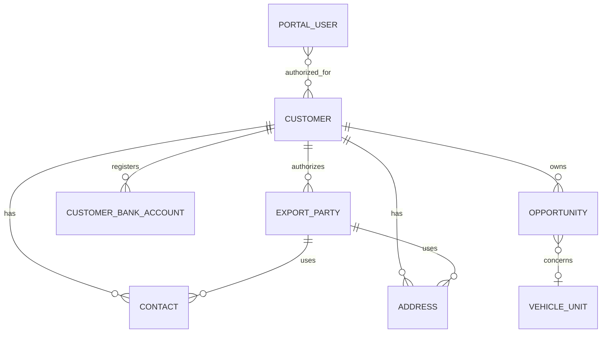

# Customer, Consignee, and Inquiry

## Objectives

- Separate a portal login from the commercial customer account.
- Support individuals and organizations without duplicating customer schemas.
- Allow a customer to use several contacts, addresses, consignees, and notify
  parties.
- Capture guest inquiries safely and convert qualified inquiries into CRM
  records.
- Assign sales ownership with an auditable workflow.
- Keep communication consent and sensitive bank information properly protected.
- Use accounting ledgers, not manually maintained customer balance columns.

## Concepts that must remain separate

### Portal User

An authenticated identity that can access the customer portal.

- Owns credentials and authentication factors.
- Can be enabled, disabled, or locked independently.
- May be linked to one or more Customer records when business rules permit.
- Receives only explicitly authorized portal data.

A submitted `user_id` from the browser is never trusted. The backend derives
the user identity from the authenticated session.

### Customer

The commercial party buying vehicles and receiving invoices.

Use the standard ERPNext Customer as the accounting and sales master.

- Individual or organization customer type
- Customer group and market territory
- Default currency, language, and payment terms
- Assigned account manager and sales team
- Tax/registration identifiers where applicable
- Credit controls and disabled status

Customer balance is derived from the general ledger and outstanding invoices.
There are no `balance_usd`, `balance_jpy`, `balance_eur`, or `balance_gbp`
fields.

### Contact

A natural person who communicates on behalf of a Customer.

- Name and role/title
- One or more validated phone numbers
- One or more validated email addresses
- Preferred channel and language
- Portal access, when granted
- Active dates

Phone and email values use child rows or standard Frappe contact details rather
than numbered columns such as `phone_2` and `email_3`.

### Address

A reusable structured address linked to a Customer or another export party.

- Address type
- Address lines
- City, state, postal code, and country
- Port preference, when relevant
- Validation status
- Effective dates

Addresses used on submitted commercial and shipping documents are copied into
immutable transaction snapshots.

### Export Party

A consignee or notify party may be the Customer, one of its organizations, an
agent, a customs broker, or an unrelated third party. A custom Export Party
record provides a reusable identity for these shipping roles.

- Legal/display name
- Party type
- Linked Customer, Supplier, or independent party
- Contacts and addresses
- Destination country
- Verification status
- Customer ownership/authorization
- Active status

The role is assigned at transaction time:

```text
Sales Order / Export Shipment
  Consignee -> Export Party A
  Notify Party -> Export Party B
```

If the notify party is the consignee, both roles reference the same Export
Party. We do not duplicate the complete record.

### Customer Bank Account

Customer-provided banking information is sensitive and must have a defined
purpose, such as verified remitter identity or approved refund destination.

- Encrypted/masked account number
- Account holder and bank
- SWIFT/BIC and branch information
- Country and currency
- Verification status and verifier
- Supporting document
- Created/updated audit

Only authorized finance staff and the owning customer can access it. API
responses return masked values by default.

## Relationships



## Customer preferences and consent

Preferences and legal consent are different.

### Experience preferences

- Preferred currency
- Preferred language
- Default destination country and port
- Steering preference
- Preferred shipping mode

### Communication consent

Use consent records rather than a collection of integer flags:

| Field | Example |
| --- | --- |
| Customer/contact | Contact receiving communication |
| Purpose | Stock alerts, promotions, service communication |
| Channel | Email, phone, SMS, WhatsApp |
| Status | Granted, withdrawn |
| Source | Registration, portal settings, staff-recorded |
| Captured at | Timestamp |
| Evidence | Request/session/audit reference |

Transactional communication, such as invoice and shipment updates, is governed
separately from marketing consent.

## Inquiry intake

### Supported inquiry types

- Vehicle inquiry
- Make an offer
- Vehicle sourcing request
- General sales inquiry
- Shipping/after-sales inquiry

`Make an offer` is a structured inquiry with proposed amount and currency. It
must not be encoded inside a free-text message.

### Guest inquiry input

```json
{
  "type": "vehicle_inquiry",
  "vehicle": "JC-000123",
  "name": "Customer name",
  "email": "customer@example.com",
  "phone": "+00000000000",
  "destination_port": "MOMBASA",
  "message": "Please send a CIF quotation.",
  "communication_consent": false
}
```

The public endpoint:

- Validates and normalizes all fields.
- Resolves the Vehicle Unit and Port by stable identifier.
- Rate-limits by IP, session, email, and device signals.
- Uses bot protection and a hidden honeypot where appropriate.
- Rejects caller-provided ownership or assignment identifiers.
- Records request metadata without storing unnecessary personal data.
- Queues notifications instead of sending mail inside the HTTP request.
- Returns a public inquiry reference, not internal CRM details.

### Deduplication

The system searches for:

1. Existing authenticated Customer.
2. Exact normalized email or phone Contact.
3. Existing open Lead/Opportunity for the same vehicle and customer.

Possible duplicates are linked or presented to staff for resolution. Records
are not merged destructively without authorization and an audit trail.

## CRM conversion

Recommended mapping:

```text
Guest inquiry
  -> Lead when no Customer exists
  -> Opportunity when a Customer is known or the Lead qualifies
  -> Quotation when pricing is requested
```

The original inquiry remains immutable as the source interaction.

### Opportunity

- Customer/Lead
- Vehicle Unit or sourcing requirements
- Destination and shipment preference
- Expected value and currency
- Sales owner/team
- Source campaign/channel
- Stage and next action
- Communication timeline

One Customer can have several concurrent Opportunities for different vehicles
or sourcing requirements.

## Assignment and workflow

Assignment must use Frappe Assignment Rules and ToDo records rather than string
columns such as `assign_by` and `assign_with`.

Suggested inquiry states:

```text
New -> Triaged -> Assigned -> Contacted -> Qualified
-> Quotation Requested -> Converted
```

Terminal states:

```text
Won, Lost, Duplicate, Spam, Closed
```

State transitions record actor, timestamp, reason, and next action. Reassignment
records both the previous and new owner.

Example automatic assignment factors:

- Customer's existing account manager
- Destination market/office
- Language
- Vehicle category
- Sales-team capacity

## Portal authorization

Every customer-facing resource is authorized through its Customer relationship.

The portal user may access only:

- Its authorized customer profile and contacts
- Its consignees/export parties
- Its inquiries and opportunities intended for customer visibility
- Its submitted quotations, orders, invoices, payments, shipments, and files

Knowing a numeric document identifier is never sufficient authorization.

Staff-only notes, margins, supplier costs, assignment history, and internal
approval records are excluded from portal response types.

## API boundary

Next.js uses purpose-built server endpoints, not a generic path proxy.

Initial operations:

```text
POST   /api/inquiries
GET    /api/portal/inquiries
GET    /api/portal/inquiries/{public_reference}
GET    /api/portal/profile
PATCH  /api/portal/profile
GET    /api/portal/export-parties
POST   /api/portal/export-parties
PATCH  /api/portal/export-parties/{public_reference}
GET    /api/portal/preferences
PATCH  /api/portal/preferences
```

The Frappe API returns explicit response DTOs. It does not serialize full
DocTypes to the public website.

## Initial Frappe mapping

| Business concept | Frappe/ERPNext implementation |
| --- | --- |
| Portal account | User plus explicit Customer authorization |
| Commercial customer | Customer |
| Person | Contact |
| Location | Address |
| Consignee/notify identity | Custom Export Party |
| Customer bank details | Custom restricted Customer Bank Account |
| Guest prospect | Lead |
| Qualified vehicle interest | Opportunity |
| Assignment | Assignment Rule and ToDo |
| Interaction history | Communication and Comment |
| Consent | Custom Communication Consent |

## Data migration rules

- Do not migrate verification codes, plaintext credentials, or old tokens.
- Deduplicate Customers by reviewed identity rules, not name alone.
- Convert numbered phone/email columns into normalized contact detail rows.
- Preserve existing consignee and notify-party transaction snapshots.
- Migrate only active reusable consignee/export-party masters.
- Recalculate balances from migrated invoices, credits, and payments.
- Keep the old database read-only for historical records that are not migrated.

## Decisions to validate

- Can one portal user manage several buying companies?
- Can one Customer have multiple portal users with different permissions?
- May independent agents buy on behalf of several Customers?
- Does JC Export need customer credit limits or only prepaid sales?
- Which countries require consignee tax or importer-registration identifiers?
- Is customer bank information genuinely required, and for which workflows?
- Which communication channels require explicit marketing consent?
