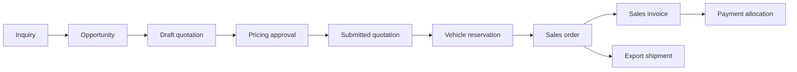

# Quotation, Reservation, and Sales

## Objectives

- Convert a qualified vehicle inquiry into an explainable quotation.
- Prevent two customers from reserving the same physical vehicle.
- Keep vehicle availability separate from payment and invoice status.
- Use ERPNext sales and accounting documents wherever they fit.
- Preserve pricing, exchange-rate, customer, consignee, and destination snapshots.
- Require approval for discounts, cost exposure, and manual price overrides.
- Support one or several vehicles in a commercial transaction.

## Commercial flow



Not every inquiry reaches every stage. A sourcing request may remain an
Opportunity until JC Export acquires or identifies a suitable Vehicle Unit.

## Quotation

Use ERPNext Quotation as the commercial offer, extended with export-specific
fields and child rows.

### Quotation header

- Customer or Lead
- Opportunity and source inquiry
- Quotation date and validity
- Quotation currency
- Destination country and port
- Shipment mode and freight term
- Payment terms
- Consignee and notify-party references, when already known
- Sales owner and responsible office
- Pricing status and approval status
- Customer-facing notes and terms

### Vehicle line

Each selected Vehicle Unit is a quotation item:

- Vehicle Unit and Item
- Stock number and chassis snapshot
- Make/model/year/specification snapshot
- Quantity fixed to one
- Base vehicle amount
- Publication availability at quotation time

### Charge breakdown

Pricing-engine components are stored as quotation charge rows:

- Component and customer-facing description
- Related vehicle, shipment, or whole quotation
- Quantity, unit, and source rate
- Original amount/currency
- Exchange rate and quotation-currency amount
- Source rate rule and rate-card version
- Tax treatment
- Included/optional status
- Manual override reason and approver

This breakdown is the source of the displayed FOB, C&F/CNF, or CIF total. These
trade terms are outputs of included components, not unrelated price columns on
Vehicle Unit.

## Quotation versions

A submitted quotation is immutable.

Changes create a revised quotation linked to the previous version:

```text
QTN-00042 v1 -> expired/superseded
QTN-00042 v2 -> current offer
```

The revision records what changed, who changed it, and why. Existing customer
links continue to show the appropriate version and status.

## Price and margin approval

The backend calculates:

```text
Acquisition and landed cost
+ Estimated sale-side charges
+ Required margin
- Discount
= Customer quotation amount
```

Supplier costs and internal margin are staff-only.

Approval is required when:

- Margin falls below the configured threshold.
- Discount exceeds the sales agent's authority.
- A rate is manually overridden.
- A missing rate is replaced with a manual estimate.
- Quote validity exceeds the normal period.
- Payment terms create additional credit exposure.

Approval limits use roles and monetary thresholds, not hardcoded user IDs.

## Vehicle reservation

Reservation is a dedicated business record, not a manually assigned vehicle
status.

### Vehicle Reservation

- Vehicle Unit
- Customer
- Opportunity, Quotation, and Sales Order references
- Reserved by and approved by
- Reservation start and expiry
- Deposit requirement
- Deposit deadline
- Reservation type
- Status and release reason

Suggested states:

```text
Pending Approval -> Active -> Converted
                 -> Expired
                 -> Released
                 -> Cancelled
```

### Reservation types

- Short sales hold
- Awaiting deposit
- Confirmed sale
- Internal/management hold

Each type has a configured maximum duration and approval requirement.

### Concurrency protection

The backend must atomically check and create the reservation.

For a single Vehicle Unit:

- At most one active external customer reservation is allowed.
- Expired reservations do not block a new reservation.
- An internal hold blocks publication and external reservation according to its
  policy.
- Availability is checked again when the Sales Order is submitted.

The database and service layer must enforce this invariant. A browser-side
availability check alone is insufficient.

### Expiry

A background job:

1. Finds active reservations past their expiry/deposit deadline.
2. Confirms that no qualifying payment or approved extension exists.
3. Marks the reservation expired.
4. Restores publication availability when no other hold exists.
5. Records the event and notifies the sales owner/customer as configured.

## Sales Order

An accepted quotation becomes an ERPNext Sales Order.

The Sales Order confirms:

- Customer and invoice party
- Vehicle Units being sold
- Accepted price components
- Destination and shipment mode
- Consignee/notify-party selections
- Payment schedule and deposit
- Delivery/export obligations
- Sales owner and company/office

The Vehicle Reservation converts to `Converted` when the Sales Order is
submitted successfully.

Cancelling a Sales Order does not blindly publish the vehicle. The release
workflow checks payments, shipment activity, management holds, and linked
documents before changing availability.

## Invoice policy

Use standard ERPNext Sales Invoice and Sales Invoice Item records.

- Invoice amounts come from the accepted Sales Order/Quotation.
- Customer outstanding balance comes from the accounting ledger.
- Payment state is derived from invoice outstanding amount.
- A vehicle may have a deposit invoice and a final invoice when commercially
  required.
- Multiple vehicles may appear on one invoice.
- One vehicle may have several legitimate billing documents without duplicating
  its identity.

Submitted invoices are corrected through ERPNext cancellation/amendment and
credit/debit note behavior. Controllers must not directly edit balances in
Customer or Vehicle Unit.

## Cancellation and release

Cancellation is a coordinated workflow, not a delete operation.

Required checks:

- Submitted invoices and credit notes
- Allocated or unallocated payments
- Shipment booking and incurred costs
- Export/customs documents
- Customer refund or retained-deposit decision
- Vehicle physical and publication state

Every cancellation records:

- Reason code and explanation
- Requester and approver
- Financial treatment
- Reservation release decision
- Customer communication
- Timestamped audit trail

## Derived availability

The website availability is computed from:

- Vehicle operational readiness
- Publication state
- Active reservation/hold
- Confirmed Sales Order
- Archival status

Example public values:

```text
Available
Temporarily Reserved
Sold
Not Published
```

`Unpaid`, `Partially Paid`, and `Paid` are not public vehicle lifecycle states.

## Customer portal

The portal presents:

- Inquiry and opportunity progress suitable for customer visibility
- Current and previous quotation versions
- Quote expiry and included price components
- Accept/decline or request-revision actions
- Reservation deadline and deposit requirement
- Confirmed order
- Invoices and payment state
- Shipment progress after booking

Internal costs, margin, staff notes, supplier rates, and approval discussions
remain private.

## Initial server operations

Purpose-built Frappe methods:

```text
POST /api/sales/opportunities/{reference}/calculate
POST /api/sales/opportunities/{reference}/quotations
POST /api/sales/quotations/{reference}/submit
POST /api/sales/quotations/{reference}/request-reservation
POST /api/sales/reservations/{reference}/approve
POST /api/sales/quotations/{reference}/accept
POST /api/sales/quotations/{reference}/request-revision
GET  /api/portal/quotations/{public_reference}
POST /api/portal/quotations/{public_reference}/accept
POST /api/portal/quotations/{public_reference}/decline
```

The method names are preliminary. Authorization and idempotency are required
before implementation.

## Idempotency and side effects

Operations that submit quotations, reserve vehicles, create Sales Orders, or
create invoices accept an idempotency key.

Retries must not create:

- Duplicate reservations
- Duplicate Sales Orders
- Duplicate invoices
- Duplicate emails or portal notifications

Email, PDF rendering, and non-critical notifications run after the database
transaction commits.

## Initial Frappe mapping

| Business concept | Frappe/ERPNext implementation |
| --- | --- |
| Qualified sale | Opportunity |
| Commercial offer | Quotation |
| Vehicle line | Quotation Item linked to Vehicle Unit |
| Price components | Custom Quotation Charge children |
| Approval | Workflow and Workflow Action |
| Vehicle hold | Custom Vehicle Reservation |
| Accepted sale | Sales Order |
| Billing | Sales Invoice |
| Correction | Credit Note/debit adjustment and amendment workflow |
| Public acceptance | Signed portal action recorded against Quotation |

## Decisions to validate

- Can a customer reserve a vehicle without paying a deposit?
- How long are standard, manager-approved, and deposit-pending holds?
- Can several customers receive quotations for the same available vehicle?
- At which event does JC Export consider the vehicle sold?
- Are container and service charges billed per vehicle or at shipment level?
- Can one Sales Order contain vehicles for different destination ports?
- Which Incoterms are actually offered and how does JC Export define each one?
- Which discount and minimum-margin approval levels are required?
- Are quotations legally binding offers or estimates subject to final freight?
