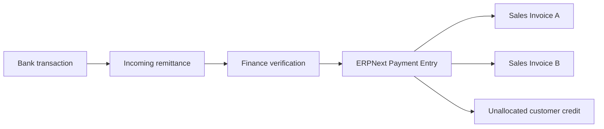

# Invoices, Payments, and Remittance Allocation

## Objectives

- Use ERPNext accounting ledgers as the financial source of truth.
- Receive and reconcile international customer remittances.
- Allocate one remittance across multiple invoices.
- Allow partial payments and customer credit without manually changing balances.
- Preserve payer, bank, currency, exchange-rate, fee, and evidence information.
- Make reversals auditable and accounting-correct.
- Derive payment status rather than storing it on Vehicle Unit.

## Financial principles

- A vehicle is not an accounting ledger.
- A customer balance is not a column that controllers increment or decrement.
- A remittance is allocated to invoices or other accounting references, not
  directly to a vehicle.
- Submitted accounting entries are corrected through cancellation or reversal,
  not edited in place.
- One amount always has one explicit currency.
- All monetary calculations use decimal arithmetic and configured rounding.

## Document model



## Sales Invoice

Use the standard ERPNext Sales Invoice.

Important behavior:

- Created from the confirmed Sales Order where possible.
- Contains one or more vehicle and service lines.
- Uses the accepted transaction currency and exchange rate.
- Carries customer, billing address, destination, and commercial snapshots.
- Supports deposit, progress, final, and adjustment invoices when required.
- Exposes outstanding amount from the general ledger.

Recommended payment states are derived:

```text
Draft
Unpaid
Partially Paid
Paid
Overdue
Credit/Refund Due
Cancelled
```

The same vehicle can have legitimate deposit and final invoices. Payment status
is therefore evaluated at the Sales Order/invoice level, not copied to Vehicle
Unit.

## Incoming Remittance

An Incoming Remittance is a custom operational record used before and during
bank reconciliation. It does not replace the accounting Payment Entry.

### Identity and evidence

- Public/internal reference
- Receiving company bank account
- Bank transaction/reference number
- Value date and received date
- Remitter name and bank details
- Customer claimed by payer
- Uploaded transfer advice and bank evidence
- Source channel/import batch

### Amounts

- Instructed amount and currency
- Gross received amount and currency
- Bank fee amount and currency
- Net received amount and currency
- Exchange rate and rate source, when conversion occurred
- Company base-currency amount

Amounts with different currencies remain separate fields with their own
currency. They are not placed into currency-specific columns.

### Workflow

```text
Imported/Reported -> Matching -> Needs Review -> Verified
                  -> Payment Entry Created -> Fully Allocated
```

Terminal/exception states:

```text
Rejected, Duplicate, Reversed, Refunded
```

## Matching

The reconciliation service proposes matches using:

- Exact bank reference
- Customer/remitter mapping
- Invoice number in remitter message
- Currency and amount
- Expected payment schedule
- Recent outstanding invoices
- Customer-provided transfer advice

Automatic matching requires a high-confidence deterministic result. Ambiguous
matches remain in `Needs Review`.

The system must prevent the same bank transaction from creating more than one
active Payment Entry.

## Payment Entry

Once verified, the system creates a standard ERPNext Payment Entry.

The Payment Entry references:

- Customer
- Company receiving bank account
- Paid-from and paid-to currencies
- Source/target exchange rates
- Received amount
- Deductions/bank charges
- One or more Sales Invoices
- Incoming Remittance reference

ERPNext Payment Entry Reference rows provide the allocation breakdown.

## Allocation

Example:

```text
Incoming payment: USD 20,000

Invoice JC-SINV-0012: USD 8,000
Invoice JC-SINV-0019: USD 7,500
Unallocated customer credit: USD 4,500
```

Allocation rules:

- Total allocated amount cannot exceed available payment amount.
- Allocation cannot exceed an invoice's outstanding amount unless an explicit
  overpayment workflow is used.
- Invoice and payment currency conversions use the accounting exchange rate.
- Allocation is performed atomically.
- Concurrent allocation attempts lock/recheck the affected payment and invoices.
- Unallocated money remains customer credit in the ledger.
- Partial allocation leaves the invoice partially paid.

The system never changes Vehicle Unit to `PAID` or `PARTIAL PAID`.

## Advance payments

Money may arrive before an invoice exists.

Record it as an advance Payment Entry for the Customer, linked where possible
to the Sales Order. Later, finance allocates the advance to submitted invoices.

This replaces manually maintained wallet or customer-balance fields.

## Bank charges and short payment

Bank deductions must be explicit.

Example:

```text
Customer instructed: USD 10,000
Bank fee:             USD     35
Net received:         USD  9,965
```

Company policy determines whether:

- Customer still owes USD 35.
- JC Export absorbs USD 35 as bank expense.
- The difference is temporarily placed in a review account.

That decision creates accounting entries and is not represented by changing a
generic `balance` value on the remittance.

## Foreign currency

Three currencies may be relevant:

- Customer/invoice currency
- Bank transaction currency
- Company base currency

The Payment Entry stores the accounting rates used. Realized exchange gain/loss
is posted through ERPNext accounting behavior.

External market rates may assist staff but do not silently overwrite an
approved bank or accounting rate.

Foreign currency may be received into a foreign-currency bank account and
converted to JPY later. Payment receipt and bank conversion are separate
accounting events. The detailed approved policy is recorded in
[Decision 002](./decisions/002-remittance-settlement.md).

## Reversal and correction

A submitted Payment Entry is not edited after reconciliation.

For a mistaken allocation:

1. Request reversal with reason.
2. Check downstream dependencies and accounting period.
3. Obtain required finance approval.
4. Cancel/reverse the Payment Entry according to ERPNext rules.
5. Create the corrected Payment Entry.
6. Link both entries to the Incoming Remittance and audit record.

Deletion of payment/allocation rows is prohibited after submission.

Refunds create their own payment/accounting documents and approval workflow.

## Invoice correction

Use ERPNext credit/debit note and amendment behavior:

- Credit note reduces the customer's liability.
- Debit adjustment increases it.
- Corrected documents reference the original invoice.
- The ledger determines the new outstanding amount.
- Vehicle and Customer balance columns are not manually updated.

## Customer portal

The portal can display:

- Invoice number, date, due date, currency, total, and outstanding amount
- Downloadable submitted invoice PDF
- Payment received and allocation status
- Incoming remittance reference and verification state
- Transfer evidence uploaded by the customer
- Unallocated customer credit where company policy permits
- Payment timeline and finance messages intended for the customer

The portal must not expose:

- Internal bank reconciliation notes
- Other customers' transactions
- Internal ledger account numbers
- Unmasked sensitive bank data
- Staff approval comments

## Initial server operations

```text
GET  /api/portal/invoices
GET  /api/portal/invoices/{public_reference}
GET  /api/portal/payments
GET  /api/portal/remittances
POST /api/portal/remittances
POST /api/portal/remittances/{public_reference}/evidence

POST /api/finance/remittances/import
POST /api/finance/remittances/{reference}/verify
POST /api/finance/remittances/{reference}/create-payment
POST /api/finance/payments/{reference}/reverse
```

Files are uploaded through controlled endpoints with file type, size, malware,
ownership, and authorization checks.

## Idempotency and controls

- Bank transaction reference plus receiving account is unique where reliable.
- Payment creation requires an idempotency key.
- Retried imports update or ignore the same staged remittance.
- Payment allocation rechecks outstanding amounts inside the transaction.
- Notifications are sent only after successful accounting submission.
- Finance actions record user, timestamp, reason, and source request.
- Closed accounting periods follow ERPNext finance controls.

## Initial Frappe mapping

| Business concept | Frappe/ERPNext implementation |
| --- | --- |
| Customer invoice | Sales Invoice |
| Deposit/advance | Payment Entry linked to Customer/Sales Order |
| Reported bank transfer | Custom Incoming Remittance |
| Bank statement line | Bank Transaction |
| Verified receipt | Payment Entry |
| Allocation | Payment Entry Reference |
| Bank fee | Payment Entry deduction/accounting line |
| Customer credit | Unallocated ledger credit |
| Credit/debit correction | Sales Invoice credit/debit note |
| Reconciliation | Bank Reconciliation and custom matching workflow |

## Migration rules

- Do not import stored customer balance columns as authoritative values.
- Import open submitted invoices and legitimate credit/debit notes.
- Import received payments with traceable bank references.
- Reconstruct allocations against invoices.
- Reconcile each customer's opening balance to the legacy accounting evidence.
- Post approved opening adjustments explicitly where reconstruction is
  impossible.
- Preserve legacy remittance documents in the read-only archive or attach them
  to migrated records after verification.

## Decisions to validate

- Which company bank accounts and currencies receive customer remittances?
- Can a payment from one remitter fund a different Customer?
- Are third-party payments permitted and what verification is required?
- Which bank fees are absorbed by JC Export?
- Can customers intentionally maintain unallocated credit?
- Are deposits refundable, partially refundable, or non-refundable?
- Who can verify, allocate, reverse, and refund a payment?
- Which accounting base currency will the JC Export company use?
