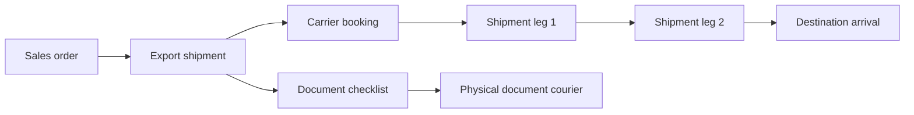

# Shipment, Documents, and Delivery

## Objectives

- Model physical export movement independently from vehicle, invoice, and file
  status.
- Use one shipping schedule structure for every region and shipment mode.
- Support RoRo, container, flat-rack, and future modes without new tables.
- Allow one shipment to contain several vehicles.
- Support multiple voyage legs and transshipment.
- Track estimated and actual milestones.
- Manage export documents with version, approval, ownership, and portal
  visibility.
- Keep courier delivery separate from vessel movement.

## Shipping concepts



## Master records

### Carrier

Use ERPNext Supplier with shipping-specific details:

- Carrier code and legal name
- Supported modes and routes
- Contacts and addresses
- Booking/API/import identifiers
- Active status

Carrier contact information is linked from Supplier/Contact/Address. It is not
copied into every freight or shipment record.

### Vessel

- IMO number where available
- Vessel name
- Carrier/operator
- Vessel type
- Flag
- Active status

Vessel name changes or spelling differences should not create unrelated
records when the IMO identity is known.

### Sailing

A scheduled carrier movement:

- Carrier
- Vessel
- Voyage number
- Shipment mode/service
- Schedule source and import reference
- Last synchronized timestamp
- Status

### Sailing Port Call

An ordered child row:

- Sailing
- Sequence
- Port
- Call type
- Estimated arrival/departure
- Actual arrival/departure
- Cut-off dates
- Terminal

This replaces one table per region and one column per port. Adding another port
creates a row, not a schema migration.

## Export Shipment

The operational record coordinating one export movement.

### Header

- Company and responsible office
- Customer and Sales Order references
- Carrier and booking reference
- Shipment mode and freight term
- Origin, load, discharge, and final delivery ports
- Consignee and notify-party snapshots
- Forwarding agent
- Sailing and voyage references
- Planning/booking owner
- Current derived milestone

### Shipment Vehicle

One child row per Vehicle Unit:

- Vehicle Unit
- Sales Order Item
- Stock/chassis snapshot
- Container assignment where applicable
- Load/discharge ports
- Freight allocation
- Current operational location
- Inclusion status

One Export Shipment can contain several customers only if company policy,
document rules, and access controls permit it. Customer portal responses must
never reveal other customers' vehicles.

### Shipment Leg

For direct or transshipment routes:

- Sequence
- Mode
- Carrier/vessel/voyage
- Origin and destination ports
- Estimated and actual departure/arrival
- Booking/Bill of Lading references
- Leg status

The customer-facing ETA is derived from the relevant final leg.

## Container planning

### Shipping Container

- Container number
- Container type and size
- Seal number
- Tare, maximum, and measured weights
- Vanning location/date
- Carrier/owner
- Shipment
- Status

Vehicles are explicitly assigned to the container. Freight allocation across
vehicles uses the actual plan and approved basis:

- Equal per vehicle
- Occupied m3
- Weight
- Negotiated/manual allocation

The system does not assume four vehicles per container.

Allocation totals must reconcile to the container freight amount.

## Operational milestones

Suggested shipment states:

```text
Planning
Awaiting Documents
Booking Requested
Booked
Vehicle to Port
At Port
Loaded
Departed
In Transit
Arrived
Customs/Release
Delivered
Cancelled
```

Milestones are backed by Shipment Event records:

- Event type
- Event time and time zone
- Planned/estimated/actual classification
- Location/port
- Source: staff, carrier import, API, customer confirmation
- Evidence and notes
- Recorded by/at

The current state is derived from approved events according to workflow rules.

Uploading a Bill of Lading may satisfy a document requirement; it does not by
itself prove departure. Uploading a surrender document or waybill does not prove
physical delivery.

## Schedule import

Carrier schedules may enter through:

- CSV/XLSX import
- Staff entry
- Carrier API
- Email/document-assisted import followed by review

All sources normalize into Sailing and Sailing Port Call records.

Import behavior:

- Match carrier, vessel, voyage, and port by stable identifiers.
- Stage uncertain matches for review.
- Update estimates without overwriting recorded actuals.
- Retain import source and timestamp.
- Be idempotent when the same schedule is imported again.
- Never create region-specific schedule tables.

## Document model

### Shipment Document Requirement

A reusable checklist rule based on:

- Destination country/port
- Shipment mode
- Vehicle class
- Carrier
- Incoterm/payment condition
- Effective dates

Examples:

- Export certificate
- Auction sheet
- Inspection certificate
- Commercial invoice
- Packing list
- Bill of Lading draft/final
- Surrender/telex release
- Waybill
- Customs or destination-specific certificate
- Spare-key record

### Shipment Document

One record per document/version:

- Export Shipment and optional Vehicle Unit
- Document type
- File
- Version
- Issuer
- Issue/expiry dates
- Verification status
- Verified by/at
- Replaces previous document
- Customer-visible status
- Confidentiality classification
- Notes and rejection reason

Files are not represented by dedicated columns such as
`bl_inhouse_documents`, `draft_documents`, and `other_documents`.

Suggested document states:

```text
Required -> Requested -> Uploaded -> Under Review -> Approved
                                     -> Rejected -> Replaced
```

`Other document` should be exceptional; normal document types are configured
master data.

## Bill of Lading

Bill of Lading data deserves structured fields in addition to the PDF:

- BL number and type
- Carrier/forwarder
- Shipper
- Consignee and notify party snapshots
- Vessel/voyage
- Ports and place of delivery
- Vehicle/container references
- Original/draft/final/surrender status
- Issue date

A BL may cover multiple vehicles. Vehicle-to-BL relationships are explicit.

Amendments create a new version and preserve the previous document and approval
history.

## Courier

Physical delivery of original documents is a separate Courier Dispatch:

- Courier provider
- Tracking number
- Recipient Export Party/Contact
- Delivery address snapshot
- Included document references
- Dispatch and estimated delivery dates
- Actual delivery and proof
- Charge amount/currency
- Status

Courier states:

```text
Preparing -> Dispatched -> In Transit -> Delivered
          -> Delivery Failed -> Returned
```

Courier delivery does not change vessel shipment state.

## Customer portal

Customer-visible shipment data:

- Booking confirmation
- Vehicle and route
- Carrier, vessel, and voyage
- Origin/destination ports
- Estimated and actual departure/arrival
- Current milestone and timeline
- Container/BL reference where permitted
- Approved customer-visible documents
- Courier tracking

The portal excludes:

- Other customers/vehicles in a shared container
- Internal costs and supplier invoices
- Internal operations notes
- Unapproved document drafts
- Confidential customs or staff files

## Notifications

Notification events may include:

- Booking confirmed
- Schedule changed
- Vehicle loaded/departed
- ETA materially changed
- Arrival confirmed
- Customer action/document required
- Document approved and available
- Courier dispatched/delivered

Notifications are queued, deduplicated, localized, and recorded as
Communications.

## Initial server operations

```text
GET  /api/portal/shipments
GET  /api/portal/shipments/{public_reference}
GET  /api/portal/shipments/{public_reference}/documents
GET  /api/portal/shipments/{public_reference}/timeline

POST /api/operations/shipments
POST /api/operations/shipments/{reference}/book
POST /api/operations/shipments/{reference}/events
POST /api/operations/shipments/{reference}/documents
POST /api/operations/schedules/import
```

Download authorization is checked at request time. Storage paths alone are not
treated as authorization.

## Initial Frappe mapping

| Business concept | Frappe/ERPNext implementation |
| --- | --- |
| Carrier/forwarder/courier | Supplier with roles |
| Carrier contact | Contact and Address |
| Vessel | Custom Vessel |
| Voyage schedule | Custom Sailing |
| Port sequence | Sailing Port Call child |
| Export movement | Custom Export Shipment |
| Included vehicles | Shipment Vehicle child |
| Transshipment | Shipment Leg child |
| Container | Custom Shipping Container |
| Milestone | Custom Shipment Event |
| Required documents | Shipment Document Requirement |
| Uploaded/versioned file | Custom Shipment Document plus File |
| Bill of Lading | Custom Bill of Lading |
| Physical document delivery | Custom Courier Dispatch |

## Migration rules

- Do not migrate region-specific schedule tables as separate structures.
- Normalize valid future/current schedules into Sailing and Port Call rows.
- Map free-text ports, carriers, vessels, and voyages through reviewed master
  records.
- Preserve active shipment bookings, actual events, and approved documents.
- Treat inferred legacy statuses as unverified unless evidence supports them.
- Preserve old files in read-only storage where migration ownership or document
  type cannot be established.
- Generate customer-visible status only after access review.

## Decisions to validate

- Can one Export Shipment include multiple customers?
- Which shipment modes and container types are actually used?
- Which carrier schedule sources are available?
- Which milestones are entered manually versus imported?
- What event proves `Loaded`, `Departed`, `Arrived`, and `Delivered`?
- Which destination documents are mandatory by market?
- Which document versions may customers download?
- Is telex release/surrender tracked separately from final BL approval?
- How are container freight and service costs allocated between vehicles?
