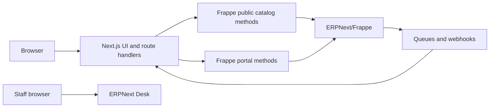

# Roles, Approvals, Audit, and APIs

## Objectives

- Apply least privilege across sales, procurement, finance, and logistics.
- Enforce segregation of duties for sensitive and financial actions.
- Scope records by company, office, market, team, and customer ownership.
- Record meaningful business events without duplicating every table.
- Give Next.js purpose-built, versioned APIs.
- Keep ERP credentials and internal DocTypes out of the browser.
- Make retries, imports, notifications, and integrations safe and observable.

## Human roles

Roles are capabilities, not job titles embedded in code. A user may hold several
approved roles.

### Recommended initial roles

| Role | Primary responsibilities |
| --- | --- |
| System Administrator | Technical configuration, no routine business approval |
| ERP Manager | Master-data and workflow administration |
| Sales Agent | Leads, opportunities, draft quotations, customer communication |
| Sales Manager | Assignment, quote approval, discount and reservation approval |
| Procurement Agent | Auction/dealer sourcing and acquisition |
| Procurement Manager | Purchase and acquisition-cost approval |
| Yard Operator | Vehicle receipt, inspection, location, and preparation updates |
| Logistics Coordinator | Booking, shipment planning, events, and documents |
| Logistics Manager | Shipment exceptions and operational approval |
| Document Controller | Document upload, classification, review, and release |
| Finance User | Remittance matching, draft payments, invoices |
| Finance Manager | Payment submission/reversal, credits, refunds, period controls |
| Customer Support | Customer-visible cases without internal financial access |
| Auditor | Read-only access to approved business and audit records |
| Customer Portal User | Explicitly authorized customer-owned portal records |

`Super Admin` is not used for ordinary work.

## Scope

Permissions may be limited by:

- Company
- Office
- Sales territory/market
- Sales team or account ownership
- Yard
- Customer authorization
- Document confidentiality

Role permission and user permission records implement scope. Controllers do not
contain hardcoded staff IDs or email addresses.

## Segregation of duties

Sensitive actions should not be completed solely by the requester when above
configured thresholds.

| Action | Maker | Approver |
| --- | --- | --- |
| Low-margin quotation | Sales Agent | Sales Manager |
| Long/internal reservation | Sales Agent | Sales Manager |
| Vehicle purchase | Procurement Agent | Procurement Manager |
| Manual landed-cost adjustment | Procurement/Finance | Authorized Manager |
| Remittance verification | Finance User | Finance Manager when required |
| Payment reversal/refund | Finance User | Finance Manager |
| Credit/debit note | Finance User | Finance Manager |
| Shipment cancellation after booking | Logistics | Logistics Manager |
| Customer-visible document release | Document Controller | Configured reviewer |

Thresholds are configuration with currency-aware limits.

## Workflow controls

Every approval records:

- Document and requested action
- Requester
- Approver
- Previous and resulting states
- Monetary impact/currency where relevant
- Reason and supporting evidence
- Request and decision timestamps

Delegation has effective dates. Users cannot approve their own request merely
because they temporarily hold both roles.

## Audit model

Use Frappe's Version, Workflow Action, Assignment, Comment, Communication, and
access logs for normal audit requirements.

Add a focused Business Event record for important cross-document events:

- Vehicle reserved/released/sold
- Quotation approved/accepted
- Manual pricing override
- Payment verified/allocated/reversed
- Invoice credited/amended
- Shipment milestone approved
- Customer-visible document released
- Customer authorization changed

Business Event fields:

- Event type and timestamp
- Actor/service identity
- Primary document and related documents
- Structured summary
- Reason/approval reference
- Correlation/request ID
- Source IP/device where justified

Do not create a complete shadow history table for every DocType. Sensitive logs
are append-only and retained according to policy.

## Authentication boundary

### Staff

Staff use Frappe/ERPNext authentication with:

- Individual accounts
- Multi-factor authentication
- No shared users
- Session/device controls
- Disabled access immediately on departure

### Customer portal

A portal identity is mapped explicitly to authorized Customer records.

Authentication may be implemented with Frappe Website Users or an external
identity provider. The final choice must support:

- Verified email
- Secure token-based password reset
- Optional MFA
- Account lockout and session revocation
- HttpOnly, Secure, SameSite cookies
- Server-side customer authorization

Verification and password-reset secrets are hashed, expire, are single-use, and
are never returned in API responses or emailed alongside plaintext passwords.

### Service identities

Next.js and integrations use separate narrowly scoped service identities:

- Public catalog reader
- Customer portal API
- Schedule/rate importer
- Internal integration where required

Secrets remain in server environment variables or a secret manager and are
rotated. TLS certificate verification is always enabled.

## Application boundary



Next.js is a backend-for-frontend:

- The browser calls JC Export Next.js endpoints.
- Next.js validates public request shape and manages the customer session.
- Next.js calls whitelisted Frappe methods.
- Frappe performs final business validation and authorization.
- Frappe returns explicit response objects.

There is no endpoint that forwards a caller-provided arbitrary backend path.

## API groups

### Public catalog

- Published vehicle search/listing
- Published vehicle detail
- Makes, models, body types, countries, and ports
- Non-binding price estimate where policy permits
- Inquiry/contact submission

Only publication-approved fields are returned.

### Customer portal

- Profile, contacts, preferences, and export parties
- Inquiries and quotations
- Orders and reservations
- Invoices, payments, and remittances
- Shipments, timelines, and approved documents

Every object is authorized through the authenticated Customer mapping.

### Integration

- Auction/source vehicle imports
- Carrier schedule imports
- Rate-card imports
- Bank transaction imports
- Media processing callbacks

Integrations are authenticated, allowlisted where appropriate, idempotent, and
audited. They are never public anonymous routes.

## API conventions

- Version external APIs, beginning with `/api/v1`.
- Use opaque public references instead of exposing sequential internal names
  where appropriate.
- Validate with explicit schemas.
- Return ISO 8601 timestamps with time zone.
- Return decimal money as strings plus ISO currency code.
- Paginate every unbounded collection.
- Use stable error codes and safe messages.
- Include correlation IDs.
- Require idempotency keys for mutation operations that create financial or
  reservation documents.
- Do not return full DocType serialization.

Example error:

```json
{
  "error": {
    "code": "RATE_NOT_AVAILABLE",
    "message": "This route requires a manual quotation.",
    "correlation_id": "req_01J..."
  }
}
```

## Catalog read model

The public catalog should not run complex ERP joins for every request.

Frappe publishes a sanitized Vehicle Listing projection containing:

- Public identity/slug
- Vehicle specifications
- Publication and availability
- Display price/estimate policy
- Primary media and optimized variants
- Search/filter fields
- Last publication revision

Next.js may cache this projection and use tag/path invalidation when Frappe
publishes, reserves, sells, hides, or updates a vehicle.

The operational Vehicle Unit and internal costs remain private.

## Files and media

- Store files in managed object/file storage.
- Keep metadata and ownership in Frappe.
- Generate optimized vehicle thumbnails/background sizes asynchronously.
- Validate MIME type, extension, size, and malware status.
- Use signed or authorized downloads for protected documents.
- Public vehicle media may use CDN URLs.
- Storage paths never grant authorization by themselves.

## Background work

Queues handle:

- Email and portal notifications
- PDF generation
- Image optimization
- Schedule/rate imports
- Webhook delivery
- Reservation expiry
- Search projection updates
- Document scanning

Jobs are retryable and idempotent. A failed notification does not roll back a
successful invoice, reservation, or payment.

## Webhooks

Events sent to Next.js or other consumers include:

- Vehicle published/updated/hidden
- Availability changed
- Quotation submitted/expired
- Reservation activated/released
- Invoice submitted/cancelled
- Payment submitted/reversed
- Shipment milestone changed
- Customer-visible document released

## Implemented integration contract

The website now uses Next.js route handlers as its backend-for-frontend:

- `POST /api/v1/inquiries`
- `GET /api/v1/inquiries/[reference]?token=...`
- `POST /api/v1/reservations`
- `POST /api/integrations/frappe`

Frappe service credentials remain server-only. Mutations require idempotency
keys, inquiry status access requires a reference-scoped HMAC lookup token, and
Frappe remains responsible for final business validation. Signed webhook events
invalidate the public vehicle cache after publication and availability changes.

Webhook requests are signed, timestamped, replay-protected, retried, and logged.

## Observability

Record:

- Structured application logs
- Correlation ID across Next.js, Frappe, queue, and integrations
- API latency/error metrics
- Queue depth/failures
- Import summaries
- Rate-resolution diagnostics
- Security and permission failures
- Webhook delivery status

Logs must not contain passwords, API secrets, reset tokens, full bank account
numbers, or unnecessary personal information.

## Environment and deployment separation

Use separate development, staging, and production sites/databases.

- Production data is not copied to development without controlled anonymization.
- Migrations and fixtures are version-controlled.
- Manual production schema changes are prohibited.
- Backups and restore procedures are tested.
- Deployment includes migration, worker, health, and rollback checks.
- CI runs automated tests before release.

## Required test layers

- Unit tests for pricing and lifecycle rules
- Permission tests for every portal resource
- Workflow tests for quotation/reservation/order/payment/shipment
- Accounting reconciliation tests
- API contract tests between Next.js and Frappe
- Import idempotency tests
- Concurrency tests for vehicle reservation and payment allocation
- Security tests for authentication, reset, upload, and object access
- End-to-end customer journey tests

## Decisions to validate

- Will staff work entirely in ERPNext Desk or require a separate operations UI?
- Should customer identity be Frappe-native or use an external identity provider?
- Which offices/territories require record-level separation?
- Which actions require maker-checker approval from launch?
- Which events and documents have legal retention requirements?
- Which integrations will be available in the first release?
